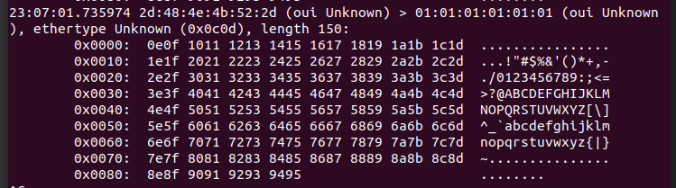

# pcap / libpcap
Discover PCAP,
- To capture packets,
- To virtualize network,
- To develop and run many network applications on the same PC but with different IP addresses,
- To monitor all the network traffic regardless the network settings of your PC.

## Requirements
- libpcap-dev
    - install: sudo apt-get install libpcap-dev
    - check: ldconfig -p | grep pcap
        - libpcap version 1.8.1 (tested version, under /usr/lib/x86_64-linux-gnu/ )
- network tools
    - install: sudo apt install net-tools
    - check: ifconfig
        - You need to see information regarding your network.
- build-essential
    - install: sudo apt-get install build-essential
    - gcc --version
        - 7.0.4 required ( tested )
    - make --version
        - GNU make 4.1 required( tested )

## Build & Run
- Build:
    - gcc pcapDiscovery.c -Wall -o pcapDiscovery -lpcap
- Run:
    - sudo ./pcapDiscovery

## Working Principle
- When a packet is received, the actual lenght and the captured length will be written on the stdin.
- A fixed packet will be sent to network.

## Test
- Type the command below to start capturing your default ethernet interface
    - sudo tcpdump
- If you can see a capture like the picture below when each packet is received, then it is working...

- 

